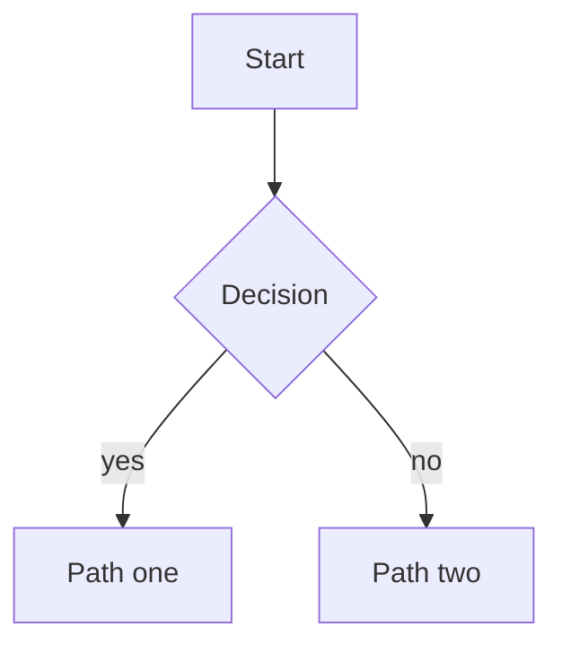

# Writing posts on this site — what the theme gives you

Everything AstroPaper v6.1 supports inside a post, with copyable syntax.

**How to read the status column.** Every feature below is marked:

| Mark | Meaning |
|---|---|
| ✅ **Verified** | Written into a real post, built, and the output inspected in `dist/`. It works here, today. |
| ❌ **Not available** | Tried it; it does not work in this install. The row says what it would take. |
| 📖 **Documented only** | Believed to work from the theme's source or docs, not exercised. Treat with suspicion. |

That distinction is the point of this file — a feature that exists in someone's
documentation but not in the installed theme is a trap, and finding out mid-post
is expensive.

- [Frontmatter](#frontmatter)
- [Callouts](#callouts)
- [Code blocks and Shiki](#code-blocks-and-shiki)
- [Diagrams](#diagrams)
- [Table of contents](#table-of-contents)
- [Images](#images)
- [Tables](#tables)
- [Footnotes](#footnotes)
- [Maths](#maths)
- [MDX](#mdx)
- [Tags](#tags)
- [URLs, drafts and scheduling](#urls-drafts-and-scheduling)
- [Free behaviour you do not write](#free-behaviour-you-do-not-write)
- [Search](#search)
- [Projects are a separate collection](#projects-are-a-separate-collection)

---

## Frontmatter

Only `title`, `description` and `pubDatetime` are required. ✅ Verified.

```yaml
---
title: The post title                      # required — becomes the <h1>
description: "One or two sentences."       # required — meta description + OG
pubDatetime: 2026-09-09T09:00:00Z          # required — ISO 8601, drives sorting
modDatetime: 2026-09-20T10:00:00Z          # optional — shows "Updated:" instead
author: Levi Maia Braga                    # optional — defaults to site.author
slug: custom-url-segment                   # optional — defaults to the filename
featured: true                             # optional — pins to the home page
draft: true                                # optional — excluded from the build
tags: [python, postgres]                   # optional — defaults to ["others"]
ogImage: "@/assets/images/cover.png"       # optional — or a remote URL
canonicalURL: https://elsewhere.com/x      # optional — only if first published elsewhere
hideEditPost: true                         # optional — irrelevant here, editPost is off
timezone: "America/Sao_Paulo"              # optional — overrides site.timezone
---
```

Notes worth having:

- **`description` is the meta description.** It is what Google shows under the
  title and what fills `og:description`. Write it for a person.
- **`featured: true`** puts the post in a `Featured` section above `Recent Posts`
  on the home page. ✅ Verified — the section only renders when a featured post
  exists.
- **`ogImage`** accepts `@/assets/...` or a remote URL. Omit it and one is
  generated per post at `/posts/<slug>/index.png`. ✅ Verified.
- **`canonicalURL`** is for content first published somewhere else. Setting it
  otherwise tells Google to rank the other URL instead of yours.
- **Do not change `slug` after publishing.** It is the URL; changing it breaks
  every inbound link and discards whatever ranking it earned.

---

## Callouts

✅ **Verified** — all types, collapsing, and custom titles render.

Blockquote syntax, via `rehype-callouts`:

```md
> [!NOTE]
> Supplementary information.

> [!TIP]
> Advice or a shortcut.

> [!WARNING]
> Something that could go wrong.

> [!DANGER]
> Serious risk — data loss, incorrect behaviour.
```

Full type list: `NOTE`, `ABSTRACT`, `INFO`, `TODO`, `TIP`, `SUCCESS`,
`QUESTION`, `WARNING`, `FAILURE`, `DANGER`, `BUG`, `EXAMPLE`, `QUOTE`. Aliases
exist (`IMPORTANT` and `HINT` → `TIP`, `CAUTION` → `WARNING`). 📖 The full list
is from the plugin's docs; I verified `NOTE`, `TIP`, `WARNING` and `DANGER`.

**Collapsible** — `-` starts collapsed, `+` starts open but can be closed. Both
render a real `<details>`. ✅ Verified.

```md
> [!WARNING]- Read before proceeding
> Hidden until the reader expands it.

> [!TIP]+ Optional detail
> Starts open, can be collapsed.
```

**Custom title** — any text after the type replaces the heading. ✅ Verified.

```md
> [!NOTE] Did you know?
> The type name is replaced by this title.
```

**When it is worth it:** a caveat that would derail a paragraph, or a long
digression worth keeping but not worth reading inline (collapsed). **When it is
not:** as decoration. A page of callouts reads like a page of shouting, and the
reader stops seeing them.

---

## Code blocks and Shiki

Syntax highlighting is Shiki, with a light/dark pair (`min-light` / `night-owl`)
that follows the theme toggle. Four transformers are registered in
`astro.config.ts`.

### File name label ✅ Verified

```md
​```ts file="src/lib/engine/decay-scorer.ts"
export function calculateDecayScores() {}
​```
```

Renders the path as a small label pinned over the block. Use it whenever the
snippet comes from a real file — it tells the reader where to look, and it is
the cheapest credibility you can add to a technical post.

### Highlight a line ✅ Verified

```md
​```ts
const a = 1;
const b = 2; // [!code highlight]
const c = 3;
​```
```

### Highlight a range ✅ Verified

```md
​```ts
// [!code highlight:2]
const first = 1;
const second = 2;
const third = 3;
​```
```

`:2` means "this line and the next". The comment itself disappears.

### Diff, added and removed ✅ Verified

```md
​```ts
const oldWay = 1; // [!code --]
const newWay = 2; // [!code ++]
​```
```

Renders green/red gutter marks. **This is the one to reach for when writing
about a change you made** — a before/after in one block beats two blocks the
reader has to diff by eye.

### Highlight a word ✅ Verified

```md
​```ts
// [!code word:targetWord]
const targetWord = "highlighted";
const other = targetWord;
​```
```

Marks every occurrence in the block. Good for tracing one identifier through a
function.

### What does NOT work here ❌

| Notation | Status |
|---|---|
| `[!code focus]` | ❌ Not available — `transformerNotationFocus` is not registered. |
| `[!code error]` / `[!code warning]` | ❌ Not available — `transformerNotationErrorLevel` is not registered. |

Both are real Shiki features; they are simply not switched on. Adding one means
importing it in `astro.config.ts` and appending it to the `transformers` array.
I tested all four notations above and these two — the table reflects what the
build actually produced, not what Shiki's docs list.

> [!WARNING]
> **`pnpm format` used to move these markers.** Prettier reformats code inside
> Markdown fences, and rewrapping a long line pushed a trailing
> `// [!code highlight]` onto its own line — which silently highlighted the
> *next* line instead. I hit this on the SerpVive page and only caught it by
> looking at the rendered output.
>
> `.prettierrc` now sets `embeddedLanguageFormatting: "off"` for `*.md` and
> `*.mdx`, so fenced code is left exactly as written. It is scoped to Markdown
> on purpose: turning it off globally breaks `prettier-plugin-astro`, which
> then cannot parse `.astro` frontmatter at all.
>
> Still worth checking the rendered page after adding notation comments.

**Copy button and line wrapping:** every code block gets a copy button
automatically (✅ verified). Long lines do **not** wrap — `wrap: false` — they
scroll horizontally, which is usually right for code.

---

## Diagrams

✅ **Verified** — Mermaid renders, in both themes.

````md

````

**This is not stock AstroPaper.** It is a local plugin —
`src/utils/remark/mermaid.ts` turns the fence into `<pre class="mermaid">`, and
`src/scripts/mermaid.ts` renders it in the browser. Consequences worth knowing:

- Mermaid (~500 KB) loads **only on pages that contain a diagram**. A post
  without one pays nothing.
- The diagram source stays in the HTML as text, so a crawler without JavaScript
  still reads the labels.
- It re-renders on theme switch, because Mermaid bakes colours into the SVG.

**When it is worth it:** a branching process, a failover order, a state machine
— anything where the prose would become "if X then Y, unless Z". **When it is
not:** a list with arrows drawn on it.

---

## Table of contents

✅ **Verified** — generated and collapsed by default.

Write this as an `h2` where you want it:

```md
## Table of contents
```

`remark-toc` fills it from the headings below, and `remark-collapse` wraps it in
a `<details>` so it starts closed. Nothing else needed.

**When it is worth it:** a long reference post someone will scan. **When it is
not:** anything under four headings — an empty-looking disclosure triangle at
the top of a short post is just noise.

---

## Images

✅ **Verified** — `src/assets/` images are optimised and converted to WebP.

**Preferred — `src/assets/`, optimised at build time:**

```md

```

**`public/`, served untouched:**

```md

```

Use `public/` only when you need a stable, predictable URL (the résumé PDF is
the example on this site). Everything else belongs in `src/assets/`, where
Astro resizes, converts and hashes it.

**An `` tag pointing at `@/assets/...` does not work in plain Markdown** —
the alias is not resolved. Use Markdown image syntax, or MDX.

**Lightbox** ✅ Verified: images inside a post are clickable and open full-size.
It comes from `src/components/ArticleEnhancements.astro`; you write nothing.

**Captions** need MDX — see below.

Compress before committing. An unoptimised screenshot in `public/` is dead
weight on every page load.

---

## Tables

✅ **Verified.** Plain Markdown tables work:

```md
| Column | Meaning |
| ------ | ------- |
| a      | b       |
```

**A wide table on a phone is the problem to plan for.** The plain table will
push the page sideways. The theme ships `ResponsiveTable`, which puts the table
in its own horizontal scroller so the page itself never scrolls — but it is a
component, so **it requires MDX**:

```mdx
import ResponsiveTable from "@/components/ResponsiveTable.astro";

<ResponsiveTable variant="striped-minimal">

| Column | Meaning |
| ------ | ------- |
| a      | b       |

</ResponsiveTable>
```

✅ Verified in MDX, including the scroller. Variants: `minimal` (no borders),
`striped` (zebra rows), `striped-minimal` (both). The blank lines around the
table are required — without them the Markdown is not parsed.

**Rule of thumb:** three columns or fewer, plain Markdown is fine. More than
that, use MDX and `ResponsiveTable`.

---

## Footnotes

✅ **Verified** — including the back-reference arrow.

```md
A claim that needs a source.[^1] And a named one.[^why]

[^1]: The footnote text.
[^why]: Named footnotes are easier to move around.
```

They collect at the bottom with links back to the reference. **When it is worth
it:** a caveat that would break the sentence but that you do not want to drop.
**When it is not:** anything the reader needs in order to follow the argument —
that belongs in the text.

---

## Maths

❌ **Not available.** Tested: `$E = mc^2$` and `$$…$$` render as literal text,
no KaTeX in the output.

The theme documents how to add it, and it is three steps:

```bash
pnpm add rehype-katex remark-math katex
```

Then register `remarkMath` and `rehypeKatex` in `astro.config.ts`, and import
the KaTeX stylesheet. Until that is done, do not write LaTeX in a post — it will
publish as dollar signs.

---

## MDX

✅ **Verified.** Rename the file to `.mdx` and you additionally get:

- **Astro/UI components**, imported and used inline — `ResponsiveTable` is the
  one that ships.
- **`<figure>` with `<figcaption>`** for captioned images. ✅ Verified.
- **JavaScript expressions** — `{2 + 2}` renders `4`. ✅ Verified.
- **Styled images**, since JSX attributes survive.

Cost: MDX is stricter. A stray `{` is a build error, and HTML must be
well-formed JSX (`class` works, but self-closing tags must actually close).

**Use `.md` by default.** Switch a post to `.mdx` when it needs a component —
usually a wide table or a captioned figure.

---

## Tags

✅ **Verified** — each tag generates its own indexable page.

```yaml
tags:
  - python
  - postgres
```

- Omitted, it defaults to `["others"]`.
- Each tag gets `/tags/<tag>/`, listed at `/tags/`.
- Tags are slugified, so `Data Structures` becomes `/tags/data-structures/`.

**The vocabulary is closed — see [docs/TAGS.md](docs/TAGS.md).** A tag that is
not on that list does not go in frontmatter; add it there first, with a line
saying what it means. Freehand tagging produces `python`, `Python` and
`python3` as three separate pages, and the system stops being trusted.

That file also carries provisional tags for every planned post, so the decision
is made once rather than at the top of each draft.

**Projects are taggable too**, using the same vocabulary and the same
`/tags/<tag>/` pages — `getUniqueTags` and the tag route span both collections.
A tag is a subject; which collection an entry lives in is not the reader's
problem.

---

## URLs, drafts and scheduling

**URL** is `/posts/<slug>/`, and `slug` defaults to the filename. ✅ Verified.

**Subdirectories become URL segments** — `src/content/posts/2026/thing.md`
publishes at `/posts/2026/thing/`. 📖 Documented; not tested here, because this
site keeps posts flat deliberately. A folder prefixed with `_` is excluded from
the URL *and* from routing entirely.

**Drafts** ✅ Verified:

```yaml
draft: true
```

Excluded from the build completely — no page, no sitemap entry, no RSS item, no
search index. Not merely hidden from the listing.

**Scheduling** 📖 Documented: a future `pubDatetime` holds the post back until
that time, with a 15-minute grace window (`posts.scheduledPostMargin`). Note
this is a **static site** — the post appears on the first build after that time,
so scheduling still needs a deploy or a scheduled rebuild to fire.

---

## Free behaviour you do not write

All ✅ verified. These come from `src/components/ArticleEnhancements.astro` and
apply to every post and project page:

| Feature | What it does |
|---|---|
| Reading progress bar | Thin accent bar at the top of the viewport as you scroll. |
| Heading anchors | A `#` appears on hover next to every `h2`–`h6`, linking to it. |
| Code copy buttons | Every code block gets one, top-right. |
| Image lightbox | Click any image in the article to open it full size. |
| Back-to-top button | Appears past 30% scroll, with a circular progress indicator. |
| Share links | Below the post — X, WhatsApp, Telegram, email. Configured in `astro-paper.config.ts`. |
| Previous / next | Adjacent posts, by date order. |
| Dynamic OG image | `/posts/<slug>/index.png`, generated with the title and author. |

**Start body headings at `h2`.** The `title` from frontmatter is the page's
`h1`; a second `h1` in the body breaks the document outline for screen readers
and for Google.

---

## Search

Pagefind, built from the **compiled** site. Two consequences:

- Search results are empty or stale under `pnpm dev`. Use
  `pnpm build && pnpm preview` to test it.
- Only elements marked `data-pagefind-body` are indexed — post pages and
  project pages. Other pages are deliberately not searchable.

---

## Projects are a separate collection

Projects live in `src/content/projects/`, not `src/content/posts/`, and have
their own frontmatter — see [SETUP.md](SETUP.md#adding-a-project). Everything in
this document about callouts, Shiki, Mermaid, images, tables and footnotes
applies to a project page identically: the two page types share one layout and
one enhancement script, on purpose.
