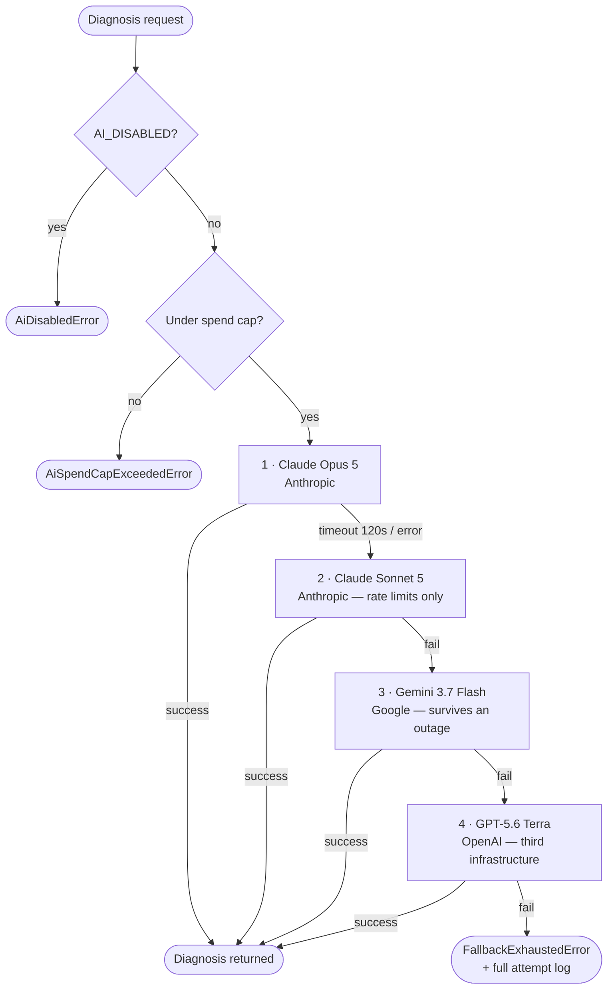
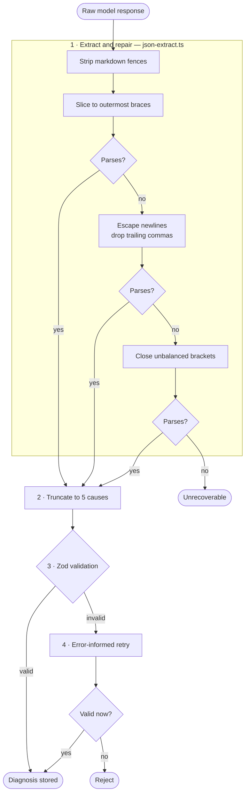

## SerpVive

**A content decay monitor for blogs.** It connects to Google Search Console,
detects which pages are losing organic traffic using a deterministic scoring
engine, and then — only for the one step that genuinely needs judgement — uses a
language model to diagnose _why_, grounded in the live search results and the
page's actual content.

[Source on GitHub](https://github.com/levimbraga/serpvive) · Next.js, TypeScript,
PostgreSQL/Supabase, Vercel · Paused since April 2026

### The problem, and where I drew the line

Bloggers and SEO consultants find decaying content by exporting Search Console
data into spreadsheets and eyeballing the deltas, page by page, month after
month. That work splits cleanly in two:

- **Detection is arithmetic.** Which pages are down, by how much, and how fast.
  Software should just do this.
- **Diagnosis is judgement.** "Why did this page lose its ranking?" requires
  comparing the page against what currently outranks it.

SerpVive is built along that seam. Detection is free, instant and reproducible.
Diagnosis costs real money and takes minutes. Keeping them separate is what
makes the product viable rather than a wrapper that bills an LLM call for
subtraction.

---

### The scoring engine is deterministic on purpose

Everything in `src/lib/engine/` is pure arithmetic. No model is involved at any
point.

**Decay score** — `(peak_clicks − current_clicks) / peak_clicks × 100`, where
peak is the highest monthly click total in a **16-month window** and current is
the sum of the last 28 days.

**Velocity**, at two resolutions — `velocity_7d` compares this week against last
week, `velocity_28d` compares the last 28 days against the 28 before that.
Positive means declining. One catches a cliff, the other catches a slide.

**Seasonality check** — the current 28-day window is compared against the same
window one year earlier. If the ratio sits within ±20%, the page is flagged
seasonal rather than decaying. This exists to kill a specific false positive: a
page that predictably dips every year is not dying.

**Noise filter** — if the peak is under 10 monthly clicks, the score is forced to
zero. Without it, a page going from 3 clicks to 1 reports as a 67% collapse and
drowns the signal. A page that is growing scores zero too.

**Why no LLM here.** The project has an explicit rule, written into its
`CLAUDE.md` before the first line of application code: _never use a language
model where deterministic math works._ The model is reserved for the single step
that cannot be computed — explaining why a page is losing, given the SERP, the
competitors' content and the page itself. That boundary is the main design
decision in the whole system, and it is the reason detection can run on every
page of every site continuously while diagnosis stays a deliberate, budgeted
action.

---

### A four-provider failover chain across three external APIs

Diagnosis calls run through a chain of four models spanning three separate
providers. The ordering is not arbitrary — it escalates by blast radius, from
the cheap fix to the full infrastructure swap:

Three mechanics make it work:

- **A 120-second timeout per attempt**, raced against the provider call. A hung
  provider cannot stall the chain.
- **No retry on the same provider.** `RETRY_SAME_PROVIDER = 0` — on failure the
  chain moves on immediately. Retrying might recover a transient blip, but it
  doubles worst-case latency on an already slow pipeline for an uncertain
  payoff, when the next link is a known-good alternative.
- **Permanent errors skip ahead.** Auth failures, invalid keys and billing
  errors are classified as non-retryable and break out immediately instead of
  burning the retry budget on something that cannot succeed.

**Both levels have fired in production.** One diagnosis of eleven completed on
Sonnet after Opus failed — a same-provider fallback. Separately, Gemini hit its
API quota mid-brief and the chain fell through to OpenAI and completed. The
design was not theoretical; it is load-bearing, and the `model_used` column and
pipeline logs are where those two episodes are recorded.

---

### A pipeline that expects malformed output

Language models return broken JSON in predictable ways, so the pipeline repairs
before it rejects. Every step below is a real branch in `json-extract.ts` and
`diagnose.ts`:

The retry is worth singling out. It does not simply ask again — it hands the
model back its own broken output together with the precise validation errors.
And the pre-validation truncation exists because a model returning six good
causes when the schema allows five is not a failure worth paying for a second
call to fix.

**Untrusted input is sanitised on the way in.** Scraped pages, competitor
content and Search Console queries all pass through `sanitize.ts` before they
reach a prompt, and model output is sanitised for XSS vectors before it is
stored or rendered. The honest provenance: this was not foresight. A security
audit flagged unsanitised external content in prompts as the top vulnerability —
a competitor could embed hidden instructions in their own HTML — and the module
is the fix.

---

### Schema and data

- **13 tables in PostgreSQL** (Supabase), with **row-level security on every
  one**. The service role used by crons and webhooks bypasses RLS deliberately;
  everything user-facing goes through it.
- **30 versioned SQL migrations**, applied in filename order.
- **42,784 Search Console query rows ingested**, across 188 real monitored
  pages. One site alone accounts for roughly 22,000 rows in `page_queries`.

### Instrumentation and cost control

Every AI call logs `tokens_input`, `tokens_output`, `cost_usd` and
`processing_time_ms` to the database. That is not decoration — it is the input
to three controls:

- **A global spend ceiling.** `AI_SPEND_CAP_USD` sums recorded cost across
  diagnoses, external analyses and demos and refuses new calls past the limit.
  It is deliberately approximate, because a run's cost is only known once it
  finishes, and deliberately **fails open**: if the lookup errors, the call
  proceeds. A budget guard that becomes a single point of failure has traded a
  few dollars for an outage.
- **A single kill switch.** `AI_DISABLED` stops every AI call at the one funnel
  they all pass through, leaving the dashboard, ingestion, scoring and email
  untouched.
- **An inactivity policy that bounds data growth.** An abandoned account keeps
  ingesting Search Console data forever; the API is free but Postgres is not
  infinite. Accounts nobody has opened in 60 days move to a `dormant` status and
  the daily cron skips them. Logging back in reactivates them automatically —
  nothing to request, nothing deleted.

The measured numbers above come from the previous model generation (Opus 4.6 /
Sonnet 4.6): 11 production diagnoses, **$0.2177 average cost per diagnosis**,
**~213 s average end-to-end latency**. The chain now points at the current
generation and has not been re-measured. The latency is not a request-response
path — a diagnosis searches Google live, crawls the page plus up to three
ranking competitors, and generates up to 8,192 output tokens before validation.

---

### The decision I defend most

**The architecture and the complete SQL schema were specified before the first
line of application code.** The initial commit contains eleven project
documents — product spec, architecture with the full schema, scope, backend
algorithms, design system — and no features. The stack was then locked against
drift by an explicit instruction never to substitute alternatives unasked.

Over **300+ commits later, the system still matches its day-one architecture
document.** That is the claim I would most want tested, and it is the one most
easily checked: the first commit is in the history, and so is everything since.

### On how it was built

> Built with heavy AI assistance, before I decided to learn properly. It works,
> it runs unattended in production, and the decision to keep it here is part of
> the story.

Because every commit was a pair session, the git history cannot separate a
human-typed line from a model-generated one, and I will not pretend otherwise.
What I can defend is every decision on this page — each has a reason I can
reconstruct, and several exist only because something broke in production and
had to be understood.

### What is not done

No automated tests and no CI — the project's biggest gap. No paying users.
Monetisation is integrated and switched off. Alerting is detected and logged but
never delivered: the product finds decay and does not tell you. The quality of
the diagnoses has never been systematically evaluated. These are listed in full,
with what I would do first about each, in the
[repository README](https://github.com/levimbraga/serpvive#current-status-and-limitations).
